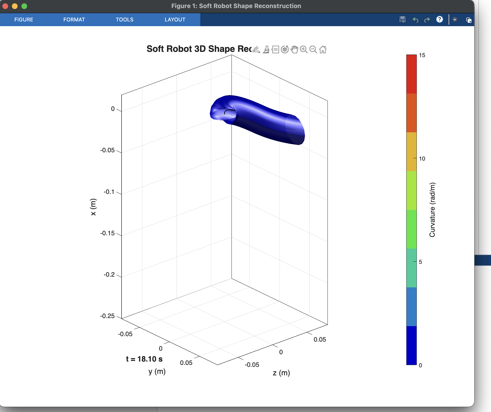
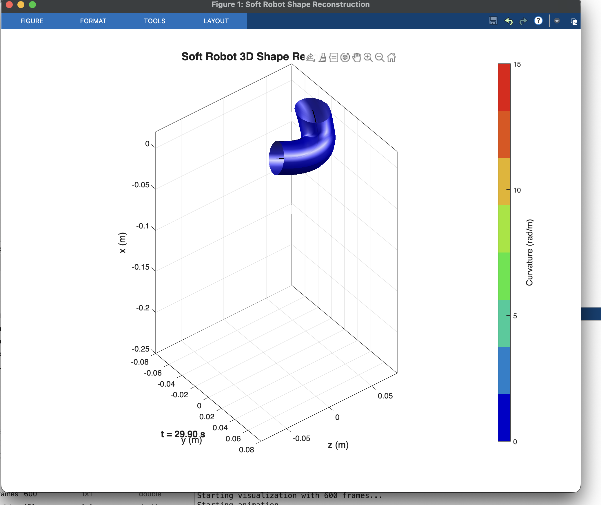
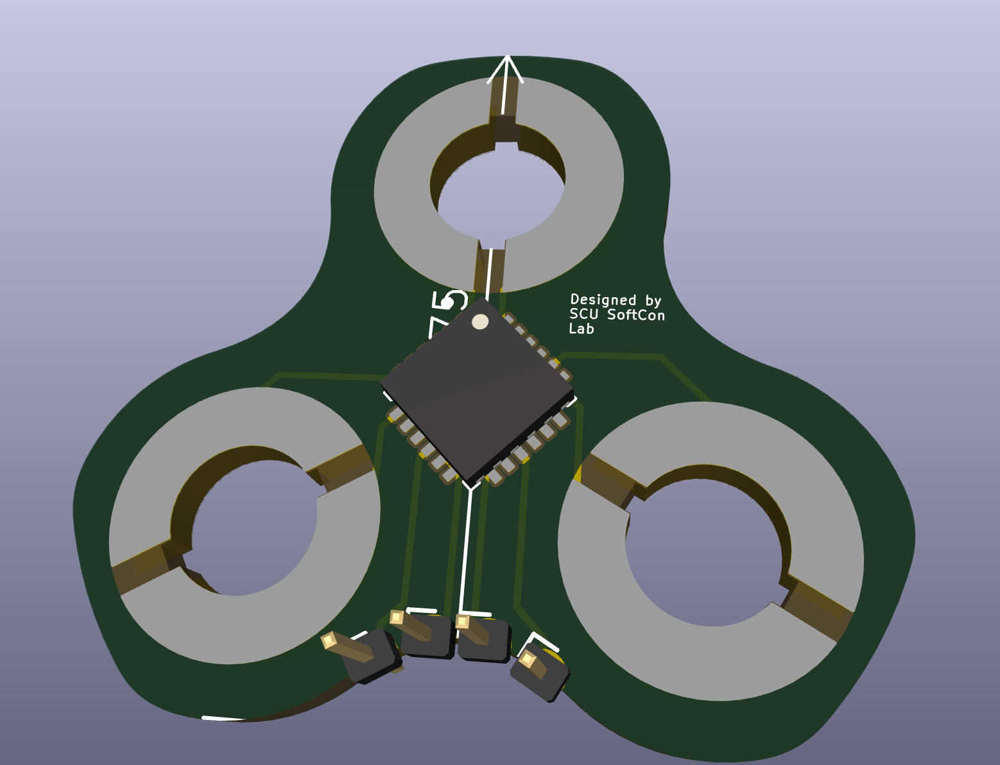

# Capacitive 6DOF Strain Sensor for Soft Robot Shape Reconstruction

This project implements a model-based proprioception system for soft robots using embedded capacitive strain sensors, inspired by the Flex-2P6D sensor design from Feliu-Talegon et al. ("Advancing Soft Robot Proprioception Through 6D Strain Sensors Embedding", Soft Robotics 2025). The approach uses a two-plate capacitive sensor that measures relative displacement and rotation between plates to compute the full 6D strain (twist, bending in two axes, axial stretch, and shear in two axes) at discrete points along the robot body. These strain measurements are then integrated using the Geometric Variable-Strain (GVS) model based on SE(3) Lie group kinematics to reconstruct the complete 3D shape of the soft manipulator. This repository contains the KiCad PCB design files for the sensor board (featuring the AD7147 capacitance-to-digital converter) and a simulation suite that generates synthetic strain data and visualizes the resulting 3D shape reconstruction in MATLAB.

## Initial "Simulation" Results

## PCB Design

